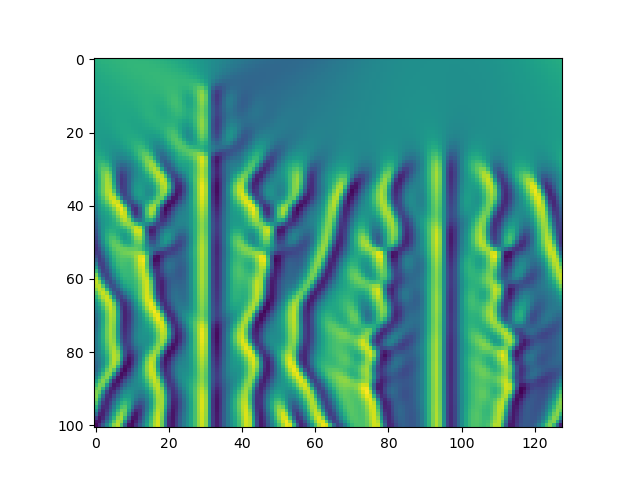

# ETDRK4

This repository contains a Python implementation of the MATLAB code provided in ["Fourth-Order Time-Stepping for Stiff PDEs"](https://doi.org/10.1137/S1064827502410633) by Aly-Khan Kassam and Lloyd N. Trefethen [1].

Both PyTorch and Numpy implementations for the Kuramoto-Sivashinsky equation are provided.

  

## Citations

    [1] @article{doi:10.1137/S1064827502410633,
            author = {Kassam, Aly-Khan and Trefethen, Lloyd N.},
            title = {Fourth-Order Time-Stepping for Stiff PDEs},
            journal = {SIAM Journal on Scientific Computing},
            volume = {26},
            number = {4},
            pages = {1214-1233},
            year = {2005},
            doi = {10.1137/S1064827502410633},
            URL = {https://doi.org/10.1137/S1064827502410633},
            eprint = {https://doi.org/10.1137/S1064827502410633}
        }

